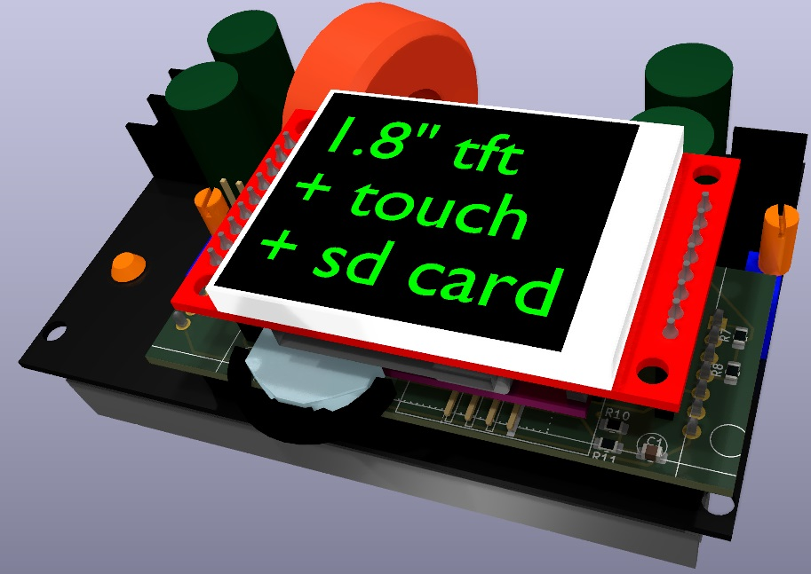
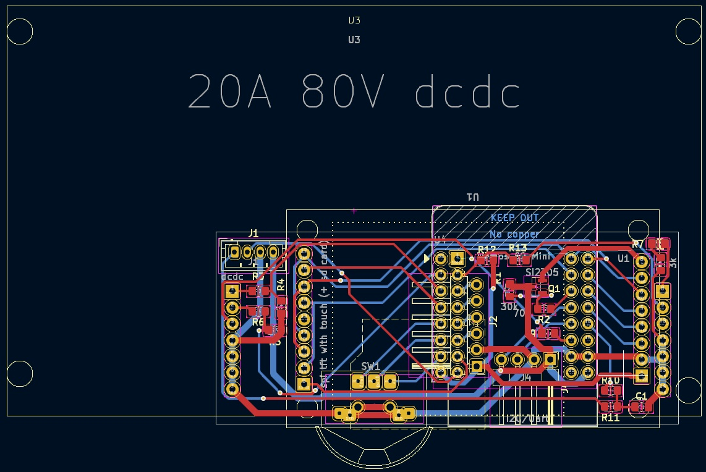
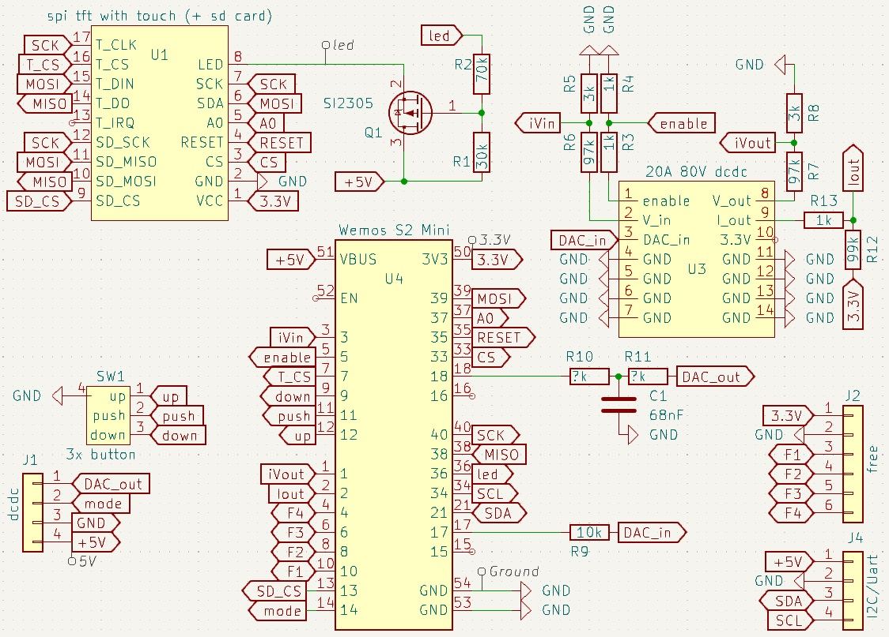
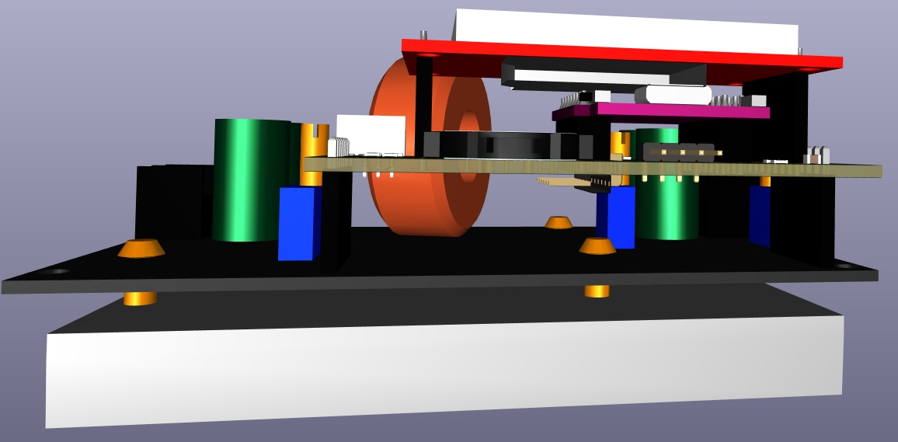
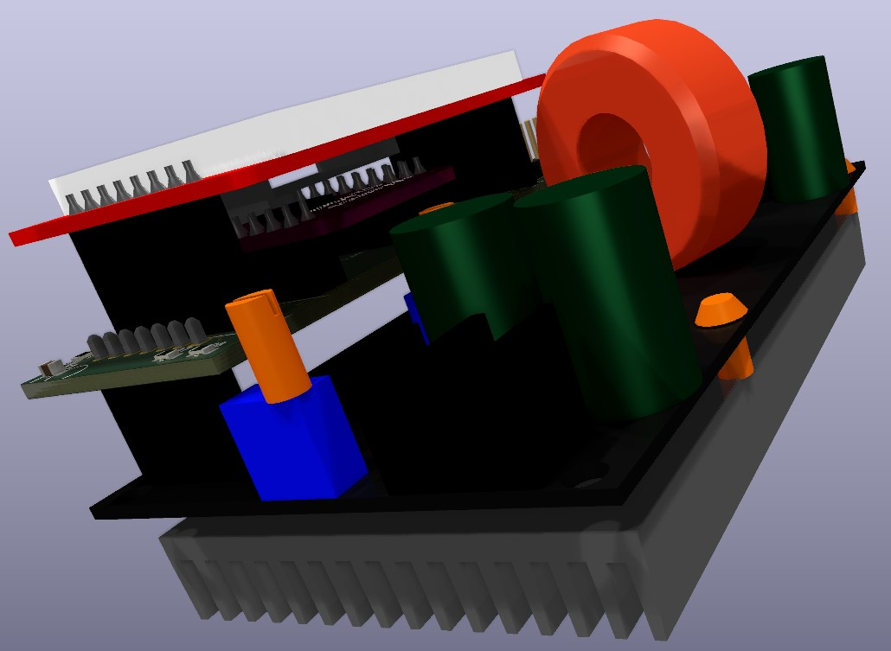

# Esp32_20A_80V_dcdc
 20A 80V dcdc/mppt with Esp32 and touch display

## KiCad pcb

## replaces lcd pickup module

https://www.aliexpress.com/item/1005004966830126.html

## KiCad circuit

## blender 3d models

## blender box / housing

## Arduino code (ssd1306)

